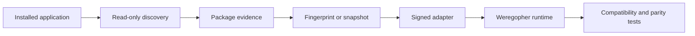

<div align="center">

# Weregopher

**An experimental compatibility runtime for installed Electron applications.**

[](https://github.com/zeidalidiez/weregopher/actions/workflows/ci.yml) [](LICENSE) [](https://www.rust-lang.org/)

Weregopher discovers installed desktop packages, records exactly what it found, and prepares them for execution through explicit compatibility adapters. It is designed to preserve application behavior while making the runtime smaller, more observable, and easier to control.

</div>

> [!IMPORTANT]
> Weregopher is pre-release research software. The foundations are under active
> development, and no application adapter is certified for production use yet.

## Why Weregopher?

Electron applications often bundle a full browser runtime even when much of that
runtime is not needed for a particular workflow. Weregopher explores a different
approach: keep the installed application's package and logic, then replace selected
runtime boundaries through a reviewed adapter.

This is deliberately narrower than "run any Electron app." Every supported build
must be discovered, fingerprinted, transformed, and tested without modifying the
vendor installation.

## How it fits together



Discovery evidence, package identity, compatibility, security posture, and
certification remain separate claims. Finding a familiar directory or executable
never makes an application compatible by itself.

## What exists today

| Area | Current state |
| --- | --- |
| Domain and protocol contracts | Implemented in Rust with deterministic JSON Schemas |
| Package manifest construction | Deterministic construction from pre-observed file records |
| Windows file observation | Bounded direct-file hashing with retained handle identity checks |
| Installed-app discovery | Known locations, uninstall registry, and Windows package catalog |
| Evidence correlation | Conservative grouping that keeps each source and confidence value intact |
| Candidate verification | Fixed-layout inputs for Codex, Hermes Agent, Discord, and Visual Studio Code |
| Compatibility contracts | Bounded, exact-target, evidence-backed assessment model; analyzers and certification are not yet implemented |
| Transformation contracts | Exact-build static-rule rebinding schemas plus Rust validation that rejects generated authority expansion; content-addressed materialization is not yet implemented |
| Transformation planning | Oxc-backed planning for exact static import and re-export specifier rewrites with explicit matcher, source, exact-cardinality, and replacement-byte limits; emits in-memory byte edits without mutating or materializing source |
| Transformation emission | Deterministic bounded in-memory transformed-source, match-evidence, Source Map v3, and canonical audit emission with complete five-artifact bundle/rebinding assembly; materialization remains pending |
| Transformation artifacts | Bounded byte-for-digest verification for source, match evidence, transformed source, source maps, and audit logs requires an opaque structural overlay proof; this does not authenticate, execute, or materialize them |
| Materialization planning | Verified artifacts produce a bounded canonical manifest with closed SHA-256 fanout paths and deduplicated digest-to-byte bindings; no filesystem writes or root safety claims yet |
| Transformation runtime | Complete in-memory plan → emit → overlay → structural validation → byte verification composition is regression-tested; content-addressed materialization and execution remain pending |
| Certified adapters | None yet |

The initial discovery work targets Codex, Hermes Agent, Discord, and Visual Studio
Code. A discovery target is not the same as a supported or certified application.

## Design rules

- Read installed packages or immutable snapshots; never patch vendor installations.
- Keep application-specific behavior in adapters instead of the core runtime.
- Bind every derived value to its evidence source and confidence.
- Treat native helpers and alternate runtimes as unrestricted same-user processes
  unless an independently tested OS sandbox proves otherwise.
- Fail closed when package identity, authority, or compatibility is unknown.
- Keep functional compatibility, security posture, and efficiency as separate results.

Weregopher is not a public-web wrapper and does not substitute websites for installed
desktop applications.

## Repository layout

```text
crates/
  weregopher-domain/       Canonical contracts and protocol types
  weregopher-discovery/    Read-only installed-application discovery
  weregopher-fingerprint/  Package records, classification, and manifests
  weregopher-transform/    Bounded semantic-transform planning and artifact verification
  weregopher-windows/      Narrow Windows platform primitives
docs/
  adr/                     Accepted architecture decisions
  spec/                    Full transformation-runtime specification
schemas/                   Generated JSON Schemas
xtask/                     Repository automation
```

## Building from source

Development is Windows-first. Platform-neutral crates are also checked on Ubuntu in
CI.

### Prerequisites

- Windows 10 or 11 on x64
- Rust 1.97.1
- `rustfmt` and `clippy`

```bash
git clone https://github.com/zeidalidiez/weregopher.git
cd weregopher

cargo test --workspace --all-features
cargo clippy --workspace --all-targets --all-features -- -D warnings
cargo fmt --all -- --check
```

The complete local gate also checks generated schemas, dependency policy, doctests,
Rustdoc warnings, and locked release builds.

## Documentation

- [Architecture and implementation specification](docs/spec/weregopher-electron-transformation-runtime-spec.md)
- [Architecture decision records](docs/adr/)
- [Security policy](SECURITY.md)
- [Contributing guide](CONTRIBUTING.md)

The specification is intentionally much broader than the current implementation.
Use the table above and the Git history to distinguish working code from planned work.

## Contributing

Issues and focused pull requests are welcome while the runtime takes shape. Read
[CONTRIBUTING.md](CONTRIBUTING.md) and the relevant ADRs before changing a public
contract. Please report security issues through GitHub's private security-advisory
channel rather than a public issue.

## License

Weregopher is licensed under the [MIT License](LICENSE). Vendor applications,
application assets, adapter inputs, and third-party dependencies retain their own
licenses and are not relicensed by this project.
