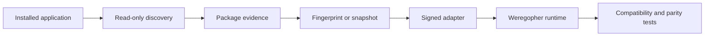

<div align="center">

# Weregopher

**An experimental compatibility runtime for installed Electron applications.**

[](https://github.com/zeidalidiez/weregopher/actions/workflows/ci.yml) [](LICENSE) [](https://www.rust-lang.org/)

Weregopher discovers installed desktop packages, records exactly what it found, and prepares them for execution through explicit compatibility adapters. It is designed to preserve application behavior while making the runtime smaller, more observable, and easier to control.

</div>

> [!IMPORTANT]
> Weregopher is pre-release research software. The foundations are under active
> development, and no application adapter is certified for production use yet.

## Why Weregopher?

Electron applications often bundle a full browser runtime even when much of that
runtime is not needed for a particular workflow. Weregopher explores a different
approach: keep the installed application's package and logic, then replace selected
runtime boundaries through a reviewed adapter.

This is deliberately narrower than "run any Electron app." Every supported build
must be discovered, fingerprinted, transformed, and tested without modifying the
vendor installation.

## How it fits together


```mermaid
flowchart LR
    A[Installed application] --> B[Read-only discovery]
    B --> C[Package evidence]
    C --> D[Fingerprint or snapshot]
    D --> E[Signed adapter]
    E --> F[Weregopher runtime]
    F --> G[Compatibility and parity tests]
```

Discovery evidence, package identity, compatibility, security posture, and
certification remain separate claims. Finding a familiar directory or executable
never makes an application compatible by itself.

## What exists today

| Area | Current state |
| --- | --- |
| Domain and protocol contracts | Implemented in Rust with deterministic JSON Schemas, including bounded execution-target, generated resolution-evidence, disposable certification-scenario, and successful scenario-report documents |
| Synthetic G1 runtime and renderer slice | Portable closed contracts, immutable private-origin assets, renderer lifecycle/authority, bounded native-binary MessagePack framing, authenticated handshake negotiation, request cancellation/deadlines, ordered events, and credit-controlled inline streams are implemented. Native Windows fixtures exercise the current-user named-pipe worker and a hidden WebView2 package → bridge → worker → DOM round trip with browser-exit and ephemeral-profile cleanup. This completes synthetic G1, not WP-D or a production renderer: atomic nonce-handle launch, non-call session/app binding, sync/deadlock handling, shared buffers, fuzzing/stress, preload/`contextBridge`, vendor compatibility, security posture, and efficiency evidence remain pending |
| OpenAI G2 target feasibility | Canonical package, preload/bridge, app-server, and aggregate evidence contracts; read-only analysis for the maintained exact Windows x64 MSIX identity; a digest-revalidating exact package-derived preload runner; bounded exact-binary schema/initialization probing; and hosted-Windows synthetic isolated-world coverage are implemented. `weregopher feasibility open-ai` can produce all three exact lanes, serially and with explicit acknowledgement, in a user-controlled disposable Windows test account/VM. G2 remains operationally incomplete until hosted native CI and the final Windows 10/11 exact matrix pass for one pinned build; configured-preload resolution, vendor renderer/IPC compatibility, certification, security posture, and efficiency remain separate claims |
| Package manifest construction | Deterministic construction from pre-observed file records, with read-only public accessors, closed transport objects, a 256-component path ceiling, a 65,536-record ceiling, and a 16 MiB aggregate normalized-path budget |
| Portable package fingerprint scan | Complete two-pass file/link scanning validates canonical path syntax and fixed record/path ceilings before hashing or retention, rejects non-root empty directories that format v1 cannot encode, and emits manifests only through the canonical builder; this is stable observational evidence, not an immutable snapshot or retained build lease |
| Windows file observation | Bounded direct-file hashing with retained handle identity checks |
| Windows package-tree observation | Bounded iterative traversal retains every root-ancestor, directory, and regular-file identity and can reopen exact manifest files through bounded identity-verified readers; denies writable retained-directory handles and rejects reparse points, unsupported or ambiguous entries, Windows ordinal case collisions, non-root empty directories, and visible membership changes; this is a live observation, not an atomic snapshot |
| Installed-app discovery | Known locations, uninstall registry, and Windows package catalog |
| Evidence correlation | Conservative grouping that keeps each source and confidence value intact |
| Candidate verification | Fixed-layout inputs for Codex, Hermes Agent, Discord, and Visual Studio Code |
| Compatibility contracts | Bounded, exact-target, evidence-backed assessment model; the first concrete analyzer maps one exact Discord adapter-marker report into a deliberately smoke-only target, while full application/runtime analyzers remain pending |
| Transformation contracts | Exact-build static-rule rebinding schemas plus Rust validation that rejects generated authority expansion; publication remains non-authorizing |
| Execution rebinding contracts | Static adapter execution-target authority is separated from bounded Windows x64 build overlays that bind exact source, package-tree, environment, adapter, target-contract, executable, and resolution-evidence identities; target contracts fix locator, argument, environment, handle, console, working-directory, dependency, posture, state, resource, and external-policy requirements while resolution evidence binds exact artifact/trust/provenance identities; structural validation and content addressing do not authenticate artifacts or authorize launch |
| Transformation planning | Oxc-backed planning for exact static import and re-export specifier rewrites with explicit matcher, source, exact-cardinality, and replacement-byte limits; emits in-memory byte edits without mutating or materializing source |
| Transformation emission | Deterministic bounded in-memory transformed-source, match-evidence, Source Map v3, and canonical audit emission with complete five-artifact bundle/rebinding assembly |
| Transformation artifacts | Bounded byte-for-digest verification for source, match evidence, transformed source, source maps, and audit logs requires an opaque structural overlay proof; this does not authenticate, execute, or materialize them |
| Materialization planning | Verified artifacts produce a bounded canonical manifest with closed SHA-256 fanout paths and deduplicated digest-to-byte bindings; no filesystem writes or root safety claims yet |
| Windows materialization | Existing disjoint managed roots publish verified manifest blobs through direct non-reparse directory handles, create-new staging, no-replace hard links, concurrent create-or-verify convergence, and post-write integrity checks; bounded leases reverify exact blobs and retain direct directory/file handles without write or delete sharing |
| Windows package snapshots | Retained package observations publish exact bytes into deduplicated managed blobs and converge on digest-bound hard-link views; bounded leases rehash every file, retain represented identities, expose exact manifest-allowlisted readers, and can bind an allowlisted file to an identity-matched locked executable while retaining the complete package lease; unrestricted physical roots can gain unlisted children even before verification returns and are not execution authority or same-user sandboxes |
| Transformation runtime | Complete plan → emit → overlay → structural validation → byte verification → managed publication → exact lease and retained package observation → snapshot → exact snapshot lease → authority-nonexpanding execution-artifact rebinding → bounded format-v2 target/resolution contracts → identity-bound retained executable capability → revocation-current local live authorization with separately mutable compatibility/consent and prevalidated exact Windows launch plan → one-shot Job-owned launch → bounded blocking policy/runtime supervision is regression-tested. A separate verified disposable-state certification runner launches exact probe-asset scenarios from retained package snapshots, terminates the complete Job, and emits canonical successful results; registry/forensic trust, durable supervisor orchestration, the replacement application runtime, and general parity probes remain pending |
| Windows process ownership | Safe Job Object capabilities apply nonzero active-process, per-process-memory, aggregate-memory, and kill-on-close limits; assigned process trees terminate on drop and support explicit whole-job termination |
| Windows process launch | Before a one-shot authorization exists, the exact path, full-width file identity, private live lock-instance identity, arguments, quoting expansion, complete `CreateProcessW` ceiling, and Job limits are validated into an opaque plan. Launch moves that plan and its already locked executable directly into suspended creation while holding policy currentness through Job assignment, membership verification, and resume; the returned owner retains the complete source lease, exact target and logical authorization-context identities, Job limits, and revocation check surface. Only vendor-equivalent full-trust posture, vendor-default ambient dependencies, and vendor-default state are currently accepted; manifest-closed dependencies and disposable/production state fail closed. This low-level Job owner is not a sealed dependency view, sandbox, or compatibility claim |
| Windows execution supervision | A bounded blocking owner loop consumes the Job-owned process, checks policy at an interval from one millisecond through 60 seconds, enforces a stricter runtime capped at 24 hours, terminates the complete Job after invalidation/deadline, confirms primary exit within five seconds, and reports exact target/context identity plus terminal outcome. Durable supervisor protocol ownership, state/application identities, graceful shutdown, remote policy refresh, and privileged-effect mediation remain pending |
| Certification evidence | Bounded canonical profiles, evidence, exact artifact-byte verification, generation-aware local class assignment, runner identity/policy, exact component-descriptor and artifact verification, verified bounded disposable-scenario selection/execution, single-use monotonic freshness, atomic dual-policy local attestations, and a bounded hash-chained filesystem ledger accepted only under an independently pinned head are implemented. The Discord marker flow loads its exact scenario from the closed runner bundle, launches a retained package snapshot through the shared runner, binds the exact semantic report and both policies, and records a local-only attestation; authenticated bundle distribution, remote signatures/key lifecycle, external revocation, the full parity DSL, and full compatibility/security/efficiency certification remain pending, and no certification result authorizes transformation or execution |
| Certified adapters | None; the local Discord marker result is smoke-scoped diagnostic evidence, not a certified application adapter |

The initial discovery work targets Codex, Hermes Agent, Discord, and Visual Studio
Code. A discovery target is not the same as a supported or certified application.

## Design rules

- Read installed packages or immutable snapshots; never patch vendor installations.
- Keep application-specific behavior in adapters instead of the core runtime.
- Bind every derived value to its evidence source and confidence.
- Treat native helpers and alternate runtimes as unrestricted same-user processes
  unless an independently tested OS sandbox proves otherwise.
- Fail closed when package identity, authority, or compatibility is unknown.
- Keep functional compatibility, security posture, and efficiency as separate results.

Weregopher is not a public-web wrapper and does not substitute websites for installed
desktop applications.

## Repository layout

```text
crates/
  weregopher-domain/       Canonical contracts and protocol types
  weregopher-discovery/    Read-only installed-application discovery
  weregopher-fingerprint/  Package records, classification, and manifests
  weregopher-adapter-openai/  Exact-build OpenAI G2 feasibility analysis
  weregopher-renderer/     Portable immutable origin, lifecycle, and bridge authority
  weregopher-renderer-webview2/  Windows-only synthetic WebView2 renderer fixture
  weregopher-runtime-protocol/  Bounded portable framing and session state
  weregopher-transform/    Bounded semantic-transform planning and artifact verification
  weregopher-windows/      Narrow Windows platform primitives
docs/
  adr/                     Accepted architecture decisions
  spec/                    Full transformation-runtime specification
schemas/                   Generated JSON Schemas
xtask/                     Repository automation
```

## Building from source

Development is Windows-first. Platform-neutral crates are also checked on Ubuntu in
CI.

### Prerequisites

- Windows 10 or 11 on x64
- Rust 1.97.1
- `rustfmt` and `clippy`

```bash
git clone https://github.com/zeidalidiez/weregopher.git
cd weregopher

cargo test --workspace --all-targets --all-features
cargo clippy --workspace --all-targets --all-features -- -D warnings
cargo fmt --all -- --check
```

The complete local gate also checks generated schemas, dependency policy, doctests,
Rustdoc warnings, and locked release builds.

For Windows transport or process changes, follow the
[runtime protocol testing matrix](docs/testing/runtime-protocol-matrix.md). It
separates portable Linux/WSL checks, native Windows tests invoked from WSL, clean
`windows-latest` CI, and the Windows 10/11 user-testing lanes. It also documents a
focused-only path for constrained development machines and moves their full matrix
to isolated CI.

The separate [OpenAI G2 feasibility runbook](docs/testing/openai-g2-feasibility.md)
stages exact installed-package inventory, preload, and app-server checks after hosted
CI, keeps them serial on user-controlled Windows, and defines the final Windows 10/11
tester matrix and evidence boundary required before G2 can pass.

## Discord local certification control plane

The Windows-only Discord marker workflow now supports a two-pass local certification
run with an exact runner bundle, a retained content-addressed package snapshot, a
verified canonical disposable scenario, a single-use pre-run challenge, and a
rollback-pinned durable ledger. The shared runner terminates the complete Job and
revalidates the retained snapshot before producing a successful semantic result. It
remains an explicitly uncertified diagnostic launch of the copied vendor Electron
runtime.

See [Discord local certification control plane](docs/certification/discord-local-control-plane.md)
for the closed runner-bundle layout, first/second-pass commands, ledger-head handling,
and the limits of the resulting `smoke_verified`, `local_only` attestation.

## Documentation

- [Architecture and implementation specification](docs/spec/weregopher-electron-transformation-runtime-spec.md)
- [Architecture decision records](docs/adr/)
- [Security policy](SECURITY.md)
- [Contributing guide](CONTRIBUTING.md)

The specification is intentionally much broader than the current implementation.
Use the table above and the Git history to distinguish working code from planned work.

## Contributing

Issues and focused pull requests are welcome while the runtime takes shape. Read
[CONTRIBUTING.md](CONTRIBUTING.md) and the relevant ADRs before changing a public
contract. Please report security issues through GitHub's private security-advisory
channel rather than a public issue.

## License

Weregopher is licensed under the [MIT License](LICENSE). Vendor applications,
application assets, adapter inputs, and third-party dependencies retain their own
licenses and are not relicensed by this project.
